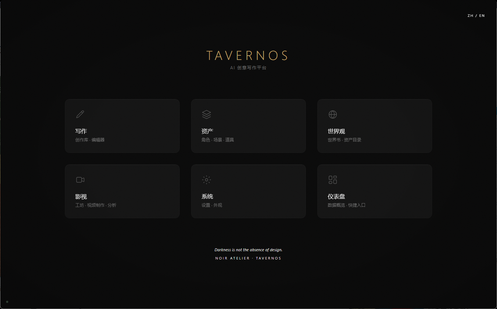

<p align="center">
  <a href="README.md">简体中文</a> · 
  <a href="README.en.md">English</a> · 
  <a href="README.ja.md">日本語</a> · 
  <a href="README.ko.md">한국어</a>
</p>

<p align="center">
  
</p>

<h1 align="center">TavernOS</h1>

<p align="center">
  <strong>墨韵万象 · 智绘奇境</strong>
</p>

<p align="center">
  <em>AI 小说创作工坊 — 多智能体叙事引擎</em>
</p>

<p align="center">
  <a href="https://github.com/mvpdark/TavernOS-Publish/releases">
    
  </a>
  <a href="https://github.com/mvpdark/TavernOS-Publish/stargazers">
    
  </a>
  <a href="https://github.com/mvpdark/TavernOS-Publish/network/members">
    
  </a>
  <a href="https://github.com/mvpdark/TavernOS-Publish/issues">
    
  </a>
  <a href="LICENSE">
    
  </a>
  <a href="https://github.com/mvpdark/TavernOS-Publish/releases">
    
  </a>
</p>

<p align="center">
  
  
  
  
  
  
</p>

---

> 「以墨为笔，以码为砚。九段 Agent 如九龙治水，共绘一卷。」

TavernOS 是一款桌面端 AI 小说创作工坊，将角色卡、世界观构建和多智能体叙事流水线融合在统一的创作环境中。它包含 9 段写作流水线、13 模块叙事引擎、状态图视频生成和角色对话系统，全部封装在跨平台 Electron 桌面应用中。

## 目录

- [系统架构](#系统架构)
- [核心功能](#核心功能)
- [快速开始](#快速开始)
- [技术栈](#技术栈)
- [仓库结构](#仓库结构)
- [下载](#下载)
- [许可证](#许可证)

<p align="center">
  
</p>

## 系统架构

<p align="center">
  
</p>

| 层级 | 阶段 | 说明 |
|:---|:---|:---|
| **输入** | 角色卡 Character Cards | 角色定义：羁绊、情绪、动机、内心独白 |
| | 世界观 World Building | 设定规则、地理、阵营动态 |
| | 故事圣经 Story Bible | 大纲、章节节拍、叙事弧线 |
| | 知识库 Lorebook | 关键词触发 + 向量 RAG 检索 |
| **流水线** | 架构师 Architect | 章节规划、场景拆分、节奏分析 |
| | 执笔 Writer | 风格指纹 + 九层上下文注入生成 |
| | 审核 Auditor | 连续性检查、钩子密度、中文数字格式 |
| | 修订 Reviser | 基于审核反馈的定向修订 |
| | 资产提取 Asset Extractor | 自动提取角色/场景/道具 + Fellegi-Sunter 匹配去重 |
| **输出** | 章节 Chapter | 动态字数（2K–8K/章），双向控制 95%–115% |
| | 视频流水线 Video Pipeline | 状态图：提示词 → 生成 → 审核 → 重滚 → 合成 |
| | 对话引擎 Chat Engine | 角色扮演 + 人格模型 + 关系追踪 |
| | 导出 Export | 多格式导出 + 风格保持 |

<details>
<summary>📖 视频流水线状态图</summary>

```
START → prompt_enhance → generate → download → frame_check
                                         ↓
                                      review → (pass / reroll / fail)
                                                   ↓        ↓        ↓
                                              post_process  reroll   fail → END
```

- 支持 6 家视频生成商（OpenAI、云雾、Seedance 等）
- LLM 自动生成改进提示词 + 重滚
- SSIM 帧检测质量控制
- 角色一致性检查（人脸嵌入）
- 口型同步集成

</details>

<p align="center">
  
</p>

## 核心功能

| 模块 | 说明 |
|:---|:---|
| **多智能体写作** | 5 段流水线，每个 Agent 独立 YAML 提示词 + 独立错误处理 |
| **角色引擎** | 7 子模块：羁绊追踪、情绪引擎、动机栈、内心独白、节奏指导、顿悟系统 |
| **叙事上下文** | 9 层记忆：故事圣经、规则、当前状态、活跃钩子、叙事上下文、知识库、向量 RAG、近章、对话摘要 |
| **资产提取** | Fellegi-Sunter 概率匹配 + 4 层去重防御 + 自动归一化 |
| **视频流水线** | 状态图引擎，9 阶段，6 家提供商，自动重滚，角色一致性，口型同步 |
| **知识库引擎** | 关键词触发注入 + 向量 RAG（minScore=0.3, topK=3, maxTokens=1500） |
| **对话系统** | 角色扮演 + 人格模型 + 关系追踪 + 多人群聊 |
| **风格指纹** | 语言特征提取，确保 AI 生成章节的作者声音一致性 |
| **桌面应用** | Electron 43，NSIS 安装器，自动更新检查，跨平台 |

<p align="center">
  
</p>

## 快速开始

### 安装

```bash
npm install -g pnpm
git clone https://github.com/mvpdark/TavernOS-Publish.git
cd TavernOS-Publish
pnpm install
```

### 配置

```bash
cp .env.example .env
# 编辑 .env 配置 LLM 提供商：
# TAVERNOS_LLM_PROVIDER=custom
# TAVERNOS_LLM_BASE_URL=https://api.openai.com/v1
# TAVERNOS_LLM_API_KEY=sk-...
# TAVERNOS_LLM_MODEL=gpt-4o
```

<details>
<summary>🔧 支持的 LLM 提供商</summary>

| 提供商 | Base URL | 说明 |
|:---|:---|:---|
| OpenAI | `https://api.openai.com/v1` | GPT-4o, GPT-4o-mini |
| 月之暗面 / Kimi | `https://api.moonshot.cn/v1` | moonshot-v1 系列 |
| 智谱 / GLM | `https://open.bigmodel.cn/api/paas/v4` | glm-4 系列 |
| DeepSeek | `https://api.deepseek.com/v1` | deepseek-chat, deepseek-coder |
| 云雾 Yunwu | `https://api.yunwu.ai/v1` | 多模型代理 |
| Grok | OAuth + PKCE | xAI 自动刷新令牌 |
| OpenRouter | `https://openrouter.ai/api/v1` | 100+ 模型 |
| Ollama | `http://localhost:11434/v1` | 本地模型 |

</details>

### 运行

```bash
pnpm dev              # 开发模式
pnpm electron:dev     # Electron 桌面应用
pnpm build            # 全量构建
```

### Docker

```bash
docker-compose up -d  # 或：docker build -t tavernos .
```

<p align="center">
  
</p>

## 技术栈

<p align="center">
  
  
  
  
  
  
  
  
  
  
  
  
  
  
  
</p>

| 层级 | 技术 |
|:---|:---|
| **语言** | TypeScript（ESM, Zod 校验） |
| **前端** | React 19, Tailwind CSS, Vite 7 |
| **桌面** | Electron 43, NSIS 安装器 |
| **后端** | Hono（服务端）, esbuild（打包） |
| **数据库** | better-sqlite3 |
| **AI/ML** | 多提供商 LLM 抽象层, 向量 RAG |
| **视频** | FFmpeg, StateGraph 流水线, 6 家提供商 |
| **构建** | pnpm workspaces, RC4 混淆保护核心 IP |

<p align="center">
  
</p>

## 仓库结构

> [!IMPORTANT]
> 本仓库是 TavernOS 的**公开发布版**。核心写作引擎以编译形式分发，以保护专有知识产权。

| 组件 | 可见性 | 路径 |
|:---|:---|:---|
| 前端 UI（React/Tailwind） | **完整源码** | `packages/studio/` |
| Electron 外壳 | **完整源码** | `electron/` |
| 基础设施（LLM、存储、类型） | **完整源码** | `packages/core/src/` |
| CLI 工具 | **完整源码** | `packages/cli/` |
| 核心写作引擎 | **编译 JS** | `packages/core/dist/` |
| 服务端（API 路由、RAG） | **编译 JS** | `dist-server/index.js` |
| Docker 配置 | **完整源码** | `Dockerfile`, `docker-compose.yml` |

<p align="center">
  
</p>

## 下载

<p align="center">
  <a href="https://github.com/mvpdark/TavernOS-Publish/releases">
    
  </a>
  <br/>
  <a href="https://github.com/mvpdark/TavernOS-Publish/releases">
    
  </a>
  <a href="https://github.com/mvpdark/TavernOS-Publish/releases">
    
  </a>
  <br/>
  <a href="https://github.com/mvpdark/TavernOS-Publish/pkgs/container/tavernos">
    
  </a>
</p>

> 从 [Releases](https://github.com/mvpdark/TavernOS-Publish/releases) 下载对应平台安装包：
> - **Windows**: `TavernOS-Setup-x.x.x-x64.exe`
> - **macOS (Intel)**: `TavernOS-x.x.x-x64.dmg`
> - **macOS (Apple Silicon)**: `TavernOS-x.x.x-arm64.dmg`
>
> Docker: `docker pull ghcr.io/mvpdark/tavernos:latest`

<p align="center">
  
</p>

## 许可证

Copyright © 2026 mvpdark. All rights reserved.

| 组件 | 许可证 |
|:---|:---|
| 前端、Electron、基础设施 | **GPL v3** |
| 核心写作引擎 | **专有** |

详见 [LICENSE](LICENSE)。

<p align="center">
  
</p>

<p align="center">
  <sub><i>TavernOS</i></sub><br/>
  <sub><i>以墨为笔，以码为砚</i></sub>
</p>
