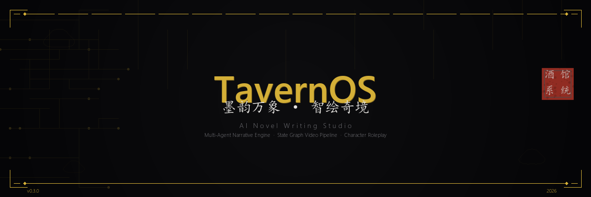
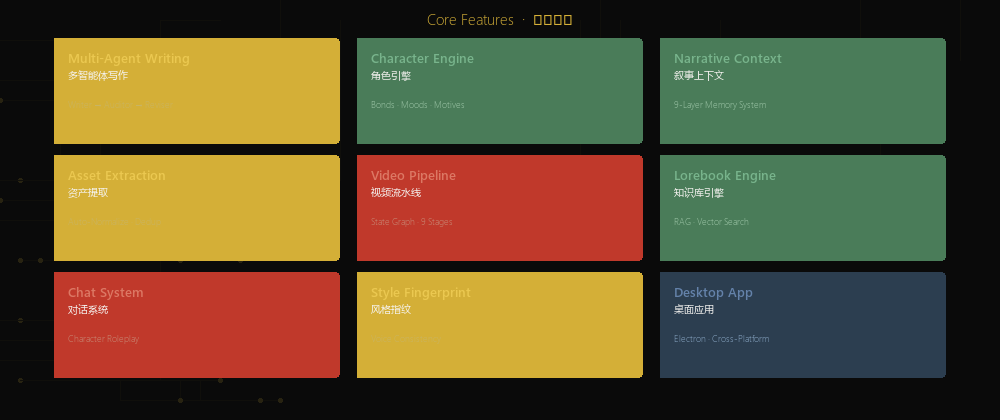
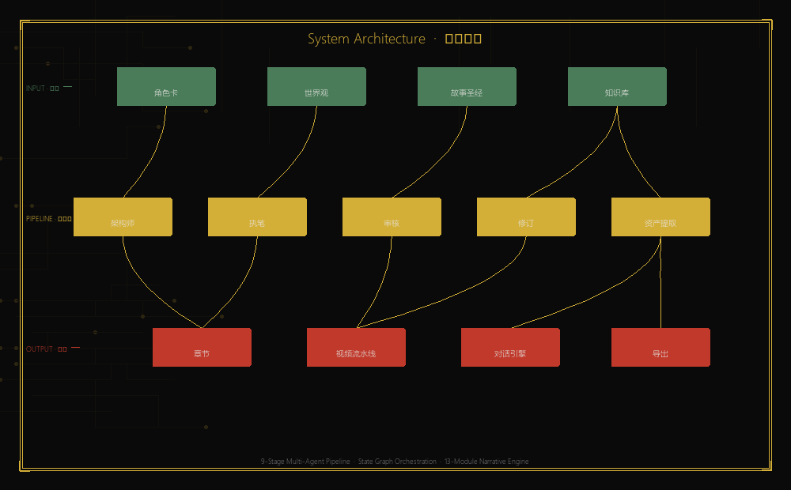

<p align="center">
  
</p>

<p align="center">
  <strong>墨韵万象 · 智绘奇境</strong>
</p>

<p align="center">
  <a href="https://github.com/mvpdark/TavernOS-Publish/releases">
    
  </a>
  <a href="https://github.com/mvpdark/TavernOS-Publish/stargazers">
    
  </a>
  <a href="https://github.com/mvpdark/TavernOS-Publish/network/members">
    
  </a>
  <a href="https://github.com/mvpdark/TavernOS-Publish/issues">
    
  </a>
  <a href="LICENSE">
    
  </a>
  <a href="https://github.com/mvpdark/TavernOS-Publish/releases">
    
  </a>
</p>

<p align="center">
  
  
  
  
  
  
</p>

<br/>

> 「以墨为笔，以码为砚。九段Agent如九龙治水，共绘一卷。」

TavernOS is a desktop AI novel writing studio that fuses character cards, world-building, and a multi-agent narrative pipeline into a single creative environment. It features a 9-stage writing pipeline (Architect → Writer → Auditor → Reviser → Asset Extractor), a 13-module narrative engine, state-graph video generation, and a character interaction system — all wrapped in a cross-platform Electron desktop app.

<br/>

<p align="center">
  
</p>

## 核心功能 · Core Features

<p align="center">
  
</p>

<br/>

| Module | Description |
|:---|:---|
| **Multi-Agent Writing** · 多智能体写作 | 5-stage pipeline: Architect → Writer → Auditor → Reviser → Asset Extractor. Each agent has dedicated YAML prompts and independent error handling. |
| **Character Engine** · 角色引擎 | Bond tracker, mood engine, motive stack, inner voice, pace director, epiphany system — 7 sub-modules for living characters. |
| **Narrative Context** · 叙事上下文 | 9-layer memory architecture: story bible, book rules, current state, active hooks, narrative context, lorebook, vector RAG, recent chapters, conversation summary. |
| **Asset Extraction** · 资产提取 | Automatic character/scene/prop extraction with Fellegi-Sunter probabilistic matching and 4-layer deduplication defense. |
| **Video Pipeline** · 视频流水线 | State graph engine: prompt → generate → download → frame check → review → reroll → post-process. Supports 6 video providers. |
| **Lorebook Engine** · 知识库引擎 | Keyword-triggered world info injection with vector RAG (minScore=0.3, topK=3) for context-aware retrieval. |
| **Chat System** · 对话系统 | Character roleplay with personality models, relationship tracking, and multi-character group chat. |
| **Style Fingerprint** · 风格指纹 | Linguistic feature extraction to maintain consistent author voice across AI-generated chapters. |
| **Desktop App** · 桌面应用 | Electron-based native application for Windows, with auto-update checking and NSIS installer. |

<br/>

<p align="center">
  
</p>

## 系统架构 · System Architecture

<p align="center">
  
</p>

<br/>

<details>
<summary>📖 Pipeline Stages Detail</summary>

<br/>

| Stage | Agent | Role |
|:---|:---|:---|
| 1 | **Architect** · 架构师 | Chapter planning, scene breakdown, pacing analysis |
| 2 | **Writer** · 执笔 | Content generation with style fingerprint and context injection |
| 3 | **Auditor** · 审核 | Continuity check, hook density, Chinese number formatting |
| 4 | **Reviser** · 修订 | Targeted revision based on auditor feedback |
| 5 | **Asset Extractor** · 资产提取 | Character/scene/prop extraction with auto-normalization |
| 6 | **Narrative Post** · 叙事后处理 | Story state update, fact vault, link graph, insight forge |

**Video Pipeline** (State Graph):
```
START → prompt_enhance → generate → download → frame_check
                                         ↓
                                      review → (pass / reroll / fail)
                                                   ↓        ↓
                                              post_process  fail → END
```

</details>

<br/>

<p align="center">
  
</p>

## 快速开始 · Quick Start

### Install

```bash
# Install pnpm
npm install -g pnpm

# Clone the repository
git clone https://github.com/mvpdark/TavernOS-Publish.git
cd TavernOS-Publish

# Install dependencies
pnpm install
```

### Configure

```bash
# Copy environment template
cp .env.example .env

# Edit .env with your LLM provider
# TAVERNOS_LLM_PROVIDER=custom
# TAVERNOS_LLM_BASE_URL=https://api.openai.com/v1
# TAVERNOS_LLM_API_KEY=sk-...
# TAVERNOS_LLM_MODEL=gpt-4o
```

<details>
<summary>🔧 Supported LLM Providers</summary>

<br/>

| Provider | Base URL | Note |
|:---|:---|:---|
| OpenAI | `https://api.openai.com/v1` | GPT-4o, GPT-4o-mini |
| Moonshot / Kimi | `https://api.moonshot.cn/v1` | moonshot-v1 series |
| Zhipu / GLM | `https://open.bigmodel.cn/api/paas/v4` | glm-4 series |
| DeepSeek | `https://api.deepseek.com/v1` | deepseek-chat, deepseek-coder |
| Yunwu | `https://api.yunwu.ai/v1` | Multi-model proxy |
| Grok | OAuth + PKCE | xAI with auto-refresh |
| OpenRouter | `https://openrouter.ai/api/v1` | 100+ models |
| Ollama | `http://localhost:11434/v1` | Local models |

</details>

### Run

```bash
# Development mode (frontend + backend)
pnpm dev

# Electron desktop app
pnpm electron:dev

# Build everything
pnpm build
```

### Docker

```bash
# Using Docker Compose
docker-compose up -d

# Or build manually
docker build -t tavernos .
```

<br/>

<p align="center">
  
</p>

## 仓库结构 · Repository Structure

> [!IMPORTANT]
> This is the **public distribution** of TavernOS. The core writing engine is distributed in compiled form to protect proprietary IP.

| Component | Visibility | Path |
|:---|:---|:---|
| Frontend UI (React/Tailwind) | **Full source** | `packages/studio/` |
| Electron shell | **Full source** | `electron/` |
| Infrastructure (LLM client, storage, types) | **Full source** | `packages/core/src/llm/`, `models/`, `crypto/` |
| CLI tools | **Full source** | `packages/cli/` |
| Core writing engine (agents, prompts, pipeline) | **Compiled JS** | `packages/core/dist/` |
| Server (API routes, memory/RAG) | **Compiled JS** | `dist-server/index.js` |
| Docker configs | **Full source** | `Dockerfile`, `docker-compose.yml` |
| Build scripts | **Full source** | `electron/build-*.cjs` |

<br/>

<p align="center">
  
</p>

## 技术栈 · Tech Stack

<p align="center">
  
  
  
  
  
  
  
  
  
  
  
  
  
  
  
</p>

<br/>

| Layer | Technology |
|:---|:---|
| **Language** | TypeScript (ESM, Zod validation) |
| **Frontend** | React 19, Tailwind CSS, Vite 7 |
| **Desktop** | Electron 43, NSIS installer |
| **Backend** | Hono (server), esbuild (bundler) |
| **CLI** | Commander |
| **Database** | better-sqlite3 |
| **AI/ML** | Multi-provider LLM abstraction, Vector RAG |
| **Video** | FFmpeg, StateGraph pipeline, 6 providers |
| **Build** | pnpm workspaces, RC4 obfuscation for core IP |

<br/>

<p align="center">
  
</p>

## 下载安装 · Download

<p align="center">
  <a href="https://github.com/mvpdark/TavernOS-Publish/releases">
    
  </a>
</p>

> Download the latest `TavernOS-Setup-x.x.x-x64.exe` from [Releases](https://github.com/mvpdark/TavernOS-Publish/releases). The app includes auto-update checking against GitHub Releases.

<br/>

<p align="center">
  
</p>

## 开发指南 · Development

<details>
<summary>🔨 Build Commands</summary>

```bash
# TypeScript compilation (all packages)
pnpm build

# Frontend only
pnpm --filter @tavernos/studio build

# Server bundle
pnpm electron:build:server

# Electron installer
pnpm electron:build:installer

# Run tests
pnpm test

# Type checking
pnpm typecheck
```

</details>

<details>
<summary>📋 Project Layout</summary>

```
TavernOS-Publish/
├── electron/           # Electron shell (main, preload, installer)
├── packages/
│   ├── core/          # Core engine (compiled dist for public repo)
│   │   ├── dist/      # Compiled JS (agents, pipeline, narrative)
│   │   └── src/       # Infrastructure source (LLM, models, crypto)
│   ├── studio/        # Frontend + server (full source)
│   │   ├── src/       # React components, pages, stores
│   │   └── server/    # API routes, middleware
│   └── cli/           # Command-line tools (full source)
├── dist-server/       # Bundled server (compiled)
├── docs/              # Documentation and assets
├── Dockerfile         # Docker support
└── docker-compose.yml # Docker Compose config
```

</details>

<br/>

<p align="center">
  
</p>

## 许可证 · License

Copyright © 2026 mvpdark. All rights reserved.

| Component | License |
|:---|:---|
| Frontend UI, Electron shell, Infrastructure | **GPL v3** |
| Core writing engine (`packages/core/dist/`) | **Proprietary** |

Source code access for the core engine is available to commercial licensees. See [LICENSE](LICENSE) for details.

<br/>

<p align="center">
  
</p>

<p align="center">
  <sub><i>酒馆系统 · TavernOS</i></sub><br/>
  <sub><i>以墨为笔，以码为砚</i></sub>
</p>
